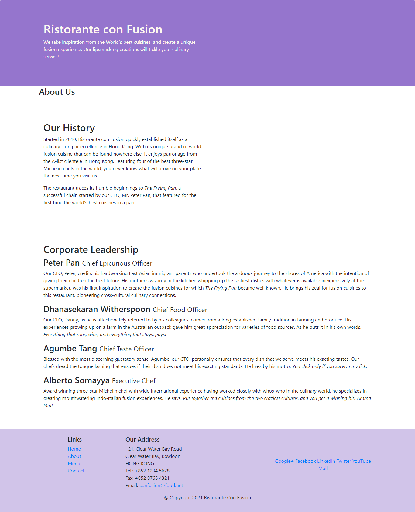
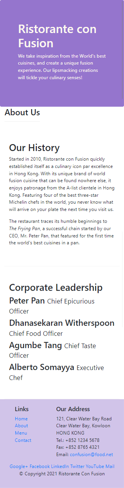

# Ristorant con Fusion

Projecto desenvolvido como exercício prático do modulo 1 (Front-End Web UI Frameworks and Tools: Bootstrap 4) do curso de Front-End Web UI Frameworks and Tools: Bootstrap 4 oferecido pela Universidade de Ciência e Tecnologia de Hong Kong através do Coursera.

## Screenshots

- Desktop

- Mobile

